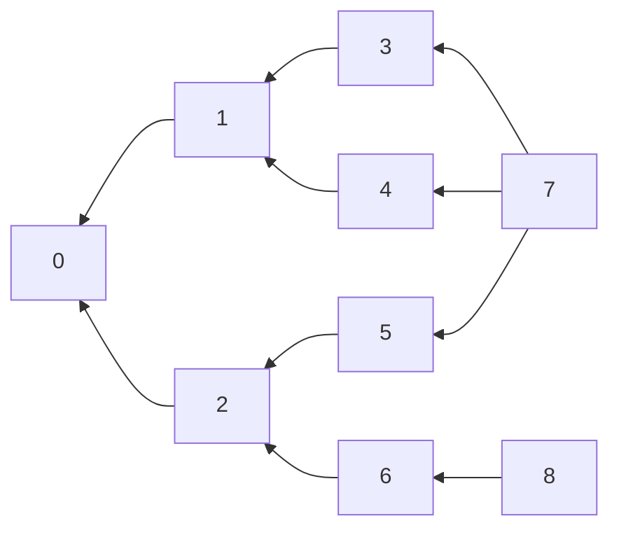
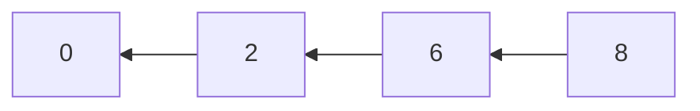
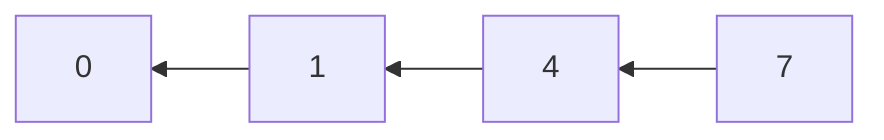

import Tabs from '@theme/Tabs';
import TabItem from '@theme/TabItem';
import style from './index.module.css'

# Getting started

## Requirements

`gs-stack` is runtime-agnostic, meaning it works in the browser, in node, deno, bun etc.

## Installation

To install `gs-stack`, use your favourite node package manager:

<Tabs>
  <TabItem value="npm" label="npm" default>

```bash
npm install gs-stack
```

  </TabItem>
  <TabItem value="pnpm" label="pnpm">

```bash
pnpm install gs-stack
```

  </TabItem>
  <TabItem value="yarn" label="yarn">

```bash
yarn add gs-stack
```

  </TabItem>
    <TabItem value="bun" label="bun">

```bash
bun add gs-stack
```

  </TabItem>
</Tabs>

Or directly from github using deno:

```ts
import { GSStack } from "https://raw.githubusercontent.com/LaMavia/graph-structured-stack/main/src/index.ts"
```

## Basics

What differentiates a graph-structured stack (GSS) from a regular stack is that its nodes can create a graph instead of a simple line. This allows for sharing common prefixes amongst multiple stacks, asymptotically saving memory. For instance, consider the following [GSS](https://en.wikipedia.org/wiki/Graph-structured_stack) containing four stacks, starting from the top: `{7,3,1,0}`, `{7,4,1,0}`, `{7,5,2,0}`, and `{8,6,2,0}`:

<div className={style["centred"]}>



</div>

Using regular stacks in this case would require duplicating common stacks:

<div className={style["centred"]}>
<div>






</div>
</div>

Because new elements can extend any stack, it is necessary to supply the head node of the stack you want extend when pushing. When no head is provided, a new stack is created. For instance, let us implement the above GSS:

```ts
import { GSStack, GSSNode } from 'gs-stack'
 
const stack = new GSStack<number>()
const nodes: Record<number, GSSNode<number>> = {}

// {7,3,1,0}
nodes[0] = stack.push(0)
nodes[1] = stack.push(1, nodes[0])
nodes[3] = stack.push(3, nodes[1])
nodes[7] = stack.push(7, nodes[3])

// {7,4,1,0}
nodes[4] = stack.push(4, nodes[1])
nodes[7] = stack.push(7, nodes[4]) // 7 isn't duplicated, as it ends up in the same layer

// {7,5,2,0}
nodes[2] = stack.push(2, nodes[0])
nodes[5] = stack.push(5, nodes[2])
nodes[7] = stack.push(7, nodes[5])

// {8,6,2,0}
nodes[6] = stack.push(6, nodes[2])
nodes[8] = stack.push(8, nodes[6])
```

The constructor of `GSStack` takes an optional `comparator: (a: T, b: T) => boolean` function, which returns `true` iff the two objects are considered "the same". By default, it is set to `===`. 

When an item is pushed to a layer, it's checked whether a node with the same value already exists in there. If it does, `push` returns a reference to said node with updated previous nodes; if it doesn't, a new node is created instead.
